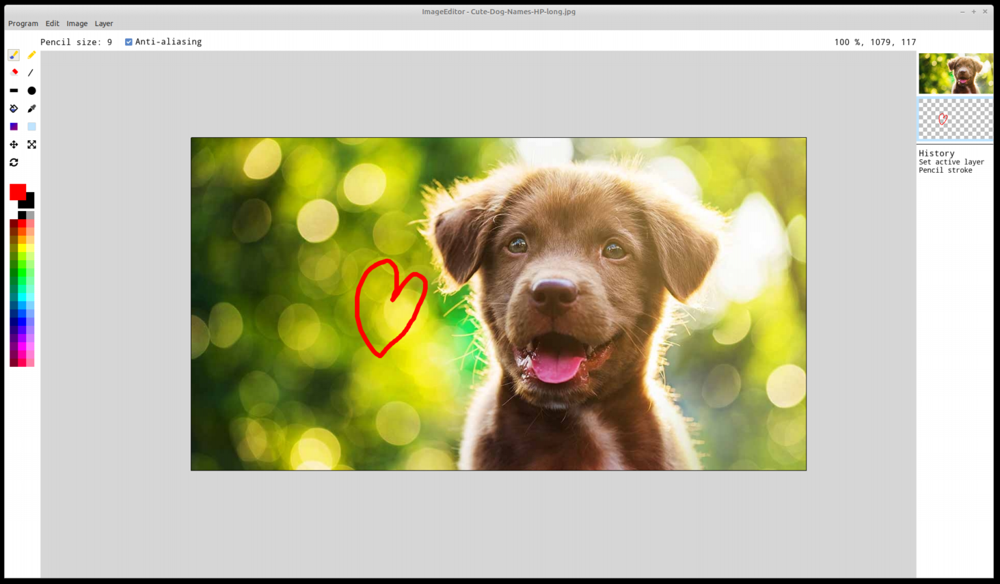

# ImageEditor
ImageEditor for Linux using gtk3.

## Requirements
* Linux. Only tested on Ubuntu 18.04 & 20.04 atm.
* gtk3
* OpenGL
* glfw3
* freetype

## Build
* Requires cargo (https://rustup.rs/)
* Build with `cargo build --release && ./package.sh`
* Build output in `imageeditor.zip`